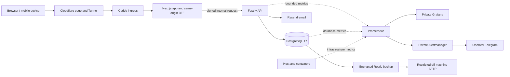

# Gym Progress Tracker

[](https://github.com/haagjjan/gym-track/actions/workflows/repo-checks.yml)
[](https://status.gymtrack.ch)
[](LICENSE)

Gym Progress Tracker is a mobile-first strength-training log for recording workouts quickly,
reusing training templates, exploring exercise progress, and understanding weekly muscle volume.

This repository contains the complete product and its operating model: the Next.js interface,
Fastify API, PostgreSQL migrations, authentication and privacy workflows, beta administration,
tests, hardened production/staging definitions, monitoring, alerting, encrypted backup and recovery
procedures, and the evidence used to prepare the Founding Beta.

> **Current release stage:** Goal 5 of the Founding Beta process is complete. The production
> service is invitation-only and capped at 50 accounts. Goal 6—the first observed cohort—requires
> a separate go/no-go decision. The public service is not open self-signup.

[Request Founding Beta access](https://app.gymtrack.ch/beta) ·
[Service status](https://status.gymtrack.ch) ·
[Security policy](SECURITY.md) ·
[Current system analysis](docs/current-system-analysis.md)

## The product

The core workflow is deliberately simple:

1. Start a workout from scratch or from a reusable template.
2. Search and add exercises from a reviewed catalog.
3. Log warm-up and working sets with weight, repetitions, reps in reserve (RIR) and notes.
4. Finish the workout and review it in History.
5. Use Progress and Weekly Volume to understand training over time.

### Training and analysis

- Mobile-first live workout logging with previous-performance context, set editing, exercise
  ordering, rest timing and local recovery of an unfinished set draft.
- Ordered workout templates that can be created, duplicated, updated and started directly.
- A reviewed 820-exercise system catalog with aliases, typo-tolerant search, muscle/equipment/type
  facets and controlled custom exercises.
- Workout history and detail, plus a documented canonical CSV import/export format with preview.
- Exercise Progress charts with range totals, tonnage, best set and estimated one-repetition max.
- Weekly muscle-volume analysis with configurable heat thresholds and interactive 2D/3D body maps.
- Responsive member surfaces for dashboard, workouts, templates, exercises, progress, volume,
  messages, help and settings.

### Accounts, privacy and beta operations

- Argon2id passwords, opaque database-backed sessions, secure cookies, login lockout, email
  verification and password recovery.
- Invitation-only production registration with hashed, expiring, single-use invitations.
- Account preferences, explicit device-storage choice, JSON export, deletion grace/cancellation and
  hard erasure with shared-exercise anonymization.
- Administrator tools for beta requests, seat limits, approval pacing, runtime pauses, user status,
  session revocation, deletion support, campaigns and audit history.
- In-app member messaging with controlled publication, pause/end behavior and bounded responses.
- Public Privacy, Terms, Cookie/Storage, Support and beta-limitations pages driven by runtime
  configuration rather than values baked into the image.

The project has no advertising SDK, social feed or third-party browser analytics. It is a training
record and analysis tool, not medical advice or an automated coaching system.

## Architecture

The browser-facing application is a same-origin system. Production does not expose Fastify or
PostgreSQL directly.



The Next.js BFF owns browser ingress, Host/Origin checks and edge-derived client attribution.
Fastify owns authentication, authorization, business transactions and persistence. Kysely keeps
queries inside feature repositories; Zod validates runtime boundaries; SQL migrations remain the
durable schema source of truth.

| Layer | Main technology |
| --- | --- |
| Web | Next.js 15 App Router, React 19, TanStack Query, Recharts, Three.js / React Three Fiber |
| API | Fastify 5, Zod, Kysely, Argon2, Papa Parse, `prom-client` |
| Data | PostgreSQL 17, `node-pg-migrate`, SQL constraints and indexes |
| Tooling | TypeScript 5.9, pnpm 10 workspaces, ESLint, Docker Compose |
| Verification | Node test runner, PostgreSQL integration tests, Playwright, axe |
| Operations | Caddy, Cloudflare Tunnel, Prometheus, Grafana, Alertmanager, Restic, systemd |

For the deeper boundary and dependency rules, read [ARCHITECTURE.md](ARCHITECTURE.md). For a
current code, hardware and deployment assessment, read
[docs/current-system-analysis.md](docs/current-system-analysis.md).

## Repository map

```text
apps/
  api/                 Fastify features, repositories, migrations and tests
  web/                 Next.js pages, BFF routes, product UI and browser tests
ops/
  production/          reviewed production Compose/Caddy definition and runbook
  staging/             isolated production-shaped staging definition and runbook
  monitoring/          Prometheus, Grafana, Alertmanager and exporters
  logging/             bounded log review, audit and retention tooling
  backup/              encrypted backup, restore tests, timers and Mac destination setup
  status/              dependency-free external status page
docs/
  decisions/           architecture decision records
  beta-process/        requirements, risks, launch gates and execution evidence
  server/              host foundation, deployment, monitoring and recovery reports
```

Root configuration owns workspace tooling, local Docker Compose, CI, engineering rules and the
retained Render deployment alternative. The detailed path-by-path map is in
[docs/repository-structure.md](docs/repository-structure.md).

## Run locally

### Requirements

- Node.js 22 or newer
- pnpm 10 or newer
- Docker with the Compose plugin

### Production-like local stack

```sh
git clone https://github.com/haagjjan/gym-track.git
cd gym-track
pnpm install
cp .env.example .env
pnpm start
```

Open [http://localhost:3000](http://localhost:3000). The stack starts PostgreSQL, applies all
migrations, then starts the API and web application. Local registration is enabled by default.

When `RESEND_API_KEY` is empty, local email action links are written to the API log instead of sent.
Empty controller/contact values deliberately show `PUBLICATION_BLOCKED` on legal pages; fill the
local `.env` if those pages need realistic rendering.

Stop the stack with:

```sh
pnpm stop
```

### Split development mode

Use Docker only for PostgreSQL, then run both applications with hot reload:

```sh
pnpm db:start
pnpm migrate:up
pnpm dev:api
pnpm dev:web
```

The API defaults to `http://localhost:4000`; the web application defaults to
`http://localhost:3000`.

## Verification

The normal repository gate is:

```sh
pnpm check
```

It runs strict type checking, linting, unit tests and production builds. Additional risk-specific
gates are separate so they can create the environment they need:

```sh
pnpm test:performance   # sequential algorithmic regression workloads
pnpm test:integration   # real PostgreSQL auth/beta/workout/admin flows
pnpm smoke:web          # Playwright member workflow, responsive and accessibility checks
```

GitHub Actions runs Project checks, API database integration and Web smoke as separate jobs for
every pull request and push to `main`. CI also verifies fresh staging PostgreSQL initialization,
the hardened offline runtime and production/staging Compose invariants. A separate manually
dispatched workflow validates and publishes the reviewed status-page bundle.

The performance suites are generous regression ceilings, not browser Core Web Vitals or a claim of
large-scale capacity. Production-shaped staging separately passed the Founding Beta target of 20
concurrent active loggers and a 40-logger 2x probe.

## Environments and operations

| Environment | Purpose | Exposure | Data |
| --- | --- | --- | --- |
| Local Compose | feature development and tests | localhost | disposable developer data |
| Staging | exact-SHA, production-shaped acceptance | owner-only Cloudflare Access | synthetic only |
| Production | invitation-only Founding Beta | `app.gymtrack.ch` through Cloudflare Tunnel | real member data |
| Status | independent incident communication | public GitHub Pages | no application data |

Production is self-hosted on a 2018 Intel Mac mini running Ubuntu 26.04 with a T2-compatible
kernel. The application, database, ingress and monitoring services run as a hardened Docker Compose
project. Staging uses separate services, networks, credentials and storage under its own server
root, but shares the physical host.

Production monitoring keeps six Prometheus targets internal, provisions three private Grafana
dashboards and evaluates 31 alert rules. Logs are structured, redacted and bounded. Encrypted
Restic backups have four daily opportunities, strict 30-day off-machine retention and isolated
PostgreSQL/configuration/erasure-ledger restore tests.

Deployment is intentionally not reduced to a copy-paste command in this README. Exact-SHA CI,
backup preflight, migrations, immutable images, health waits, rollback capture and external
verification are required. Use the reviewed runbooks:

- [Production operations](ops/production/README.md)
- [Staging operations](ops/staging/README.md)
- [Monitoring](ops/monitoring/README.md)
- [Logging](ops/logging/README.md)
- [Backup and recovery](ops/backup/README.md)
- [External status page](ops/status/README.md)

Render configuration remains in the repository as an alternative deployment path; it is not the
active production platform.

## Project status and boundaries

The Founding Beta is English-only, for adults resident in Switzerland, invitation-only and limited
to 50 reserved/active seats. Every current launch gate is closed, including production security,
data lifecycle, restore, capacity, real-device, email, incident and status-page rehearsals.

The next step is a deliberate Goal 6 go/no-go decision followed by a maximum first cohort of ten
invitations and a 72-hour observation period. This repository does not claim:

- high availability or automatic failover;
- readiness for arbitrary or hostile Internet scale;
- independent penetration-test certification;
- medical, legal or professional training advice;
- complete assistive-technology coverage beyond the documented Founding Beta scope.

Current gate evidence and rollout stop rules are in
[docs/beta-process/public-beta/goal-1/launch-gates.md](docs/beta-process/public-beta/goal-1/launch-gates.md).

## Documentation guide

Start here depending on the question:

| Question | Document |
| --- | --- |
| What exists and how does it run now? | [Current system analysis](docs/current-system-analysis.md) |
| What should the product do? | [Product requirements](docs/01-requirements.md) |
| How are code boundaries organized? | [Architecture](ARCHITECTURE.md) and [implementation pattern](docs/07-implementation-pattern.md) |
| Why were major choices made? | [Architecture decisions](docs/decisions/README.md) |
| What does the data model support? | [Query list](docs/02-query-list.md), [data notes](docs/03-data-model-notes.md), [schema](docs/04-schema-draft.md) |
| What does the API expose? | [API contract](docs/05-api-contract.md) |
| Is the Founding Beta ready? | [Launch gates](docs/beta-process/public-beta/goal-1/launch-gates.md) and [Goal 5 closure](docs/beta-process/public-beta/goal-5/goal-5-scope.md) |
| How is the server operated or recovered? | [Server index](docs/server/SERVER-SETUP-INDEX.md) and [disaster recovery](docs/server/disaster-recovery.md) |
| How should changes be made? | [Engineering rules](ENGINEERING.md) and [Contributing](CONTRIBUTING.md) |

Historical roadmaps and execution reports intentionally preserve the state at the time they were
written. Prefer the current analysis, current README, ADRs and exact execution reports when older
“remaining work” text conflicts with completed evidence.

## Security

Please report vulnerabilities privately to **security@gymtrack.ch**. Do not test against another
member's data or run disruptive automation against the live service. Full scope, expectations and
safe-testing boundaries are in [SECURITY.md](SECURITY.md).

## Contributing

This is currently a single-owner project, but focused issues and pull requests are welcome. Read
[CONTRIBUTING.md](CONTRIBUTING.md) and [ENGINEERING.md](ENGINEERING.md) before changing application
code. Architecture, schema, authentication, API or deployment-direction changes require an ADR.

## License

Source code is available under the [MIT License](LICENSE). Bundled 3D assets, exercise-source data
and other third-party material have separate attribution or license terms recorded in
[NOTICE](NOTICE).
