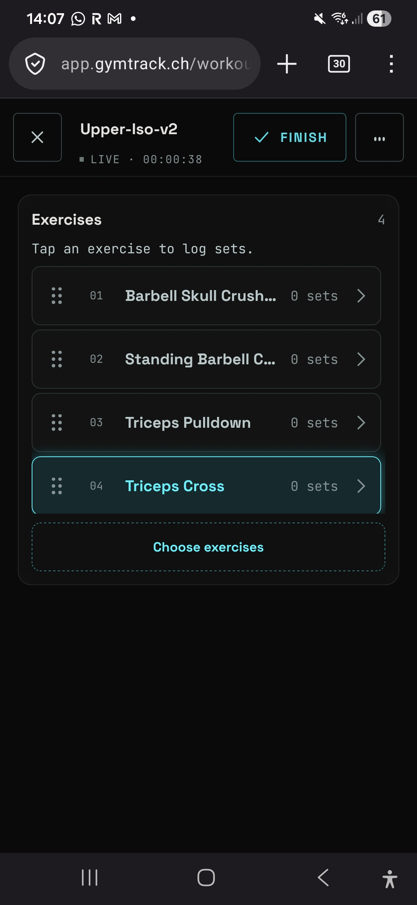
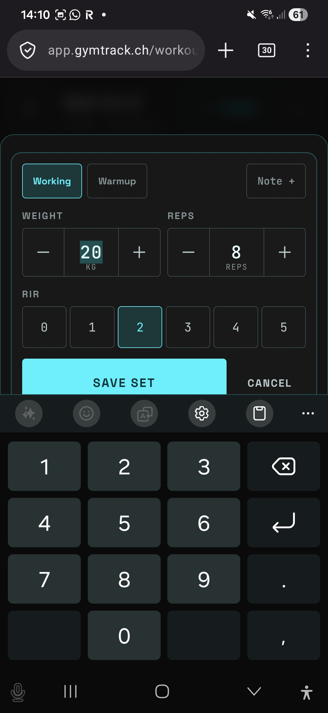
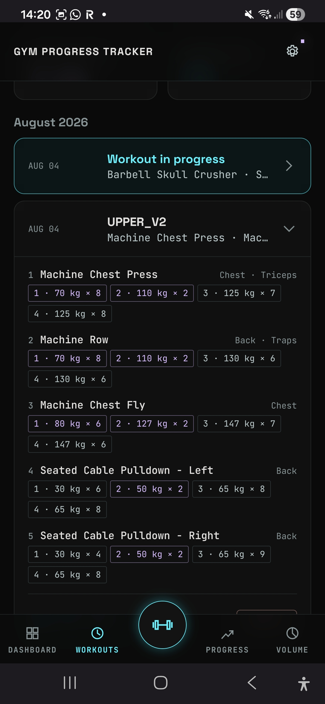
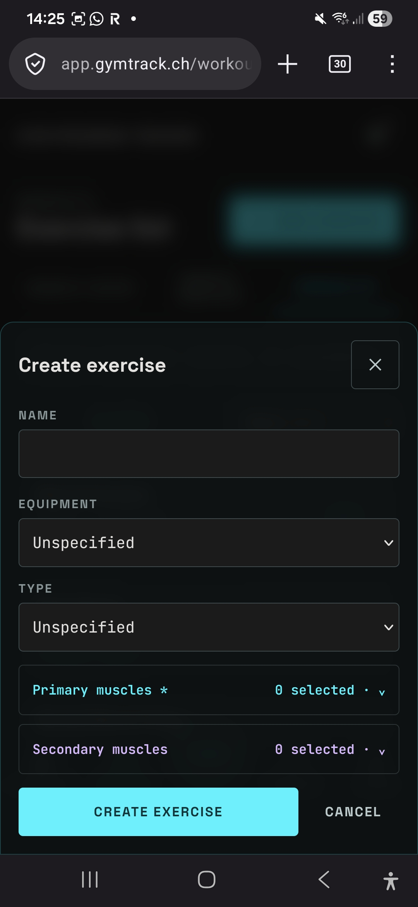
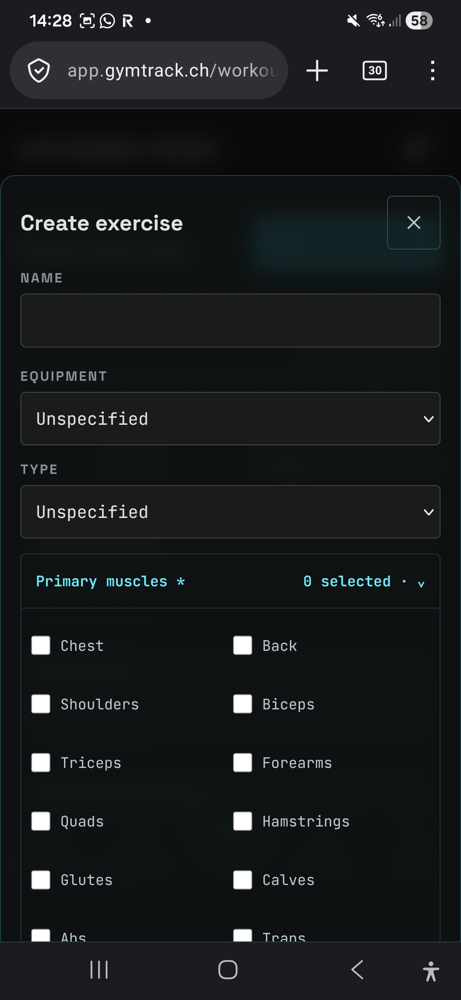
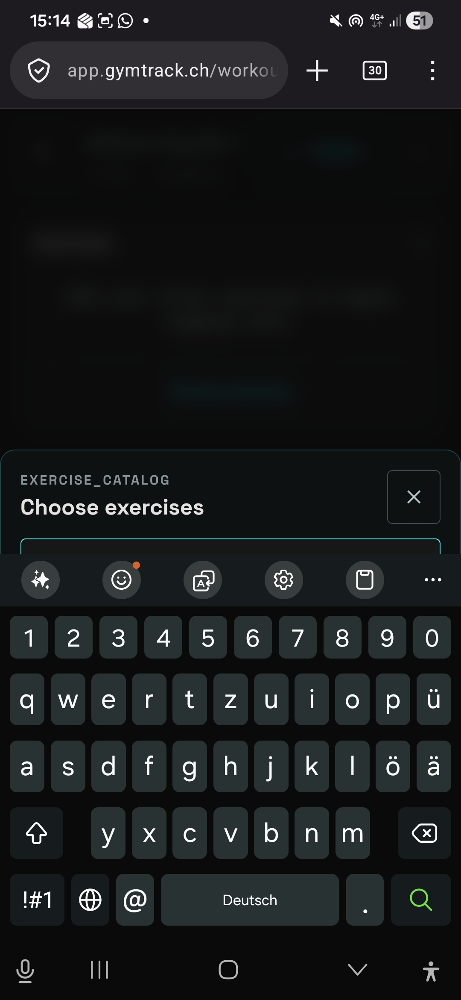

## Black-box workout test

Date: 28.7, 1.8, 4.8.
Device: Samsung S22 Plus
Browser: Firefox
Network: Mobile Data
Production release: 1ba15973df255d2e5bd3b94def03e25b050e870a
Tester: Jan Haag

### Access
- Cloudflare OTP: Yes
- Gym Tracker login: Yes
- Loading time: Unsignificant - 3d statue took a bit longer then rest
- Problems: None

### Workout flow
- Start/resume workout: Good no problem really
- Add exercises: suboptimal and inconvenient
- Add sets: A bit inconvenient
- Edit sets: minor inconveniences
- Delete sets: Works
- Reordering: Works
- Saving feedback: Works
- Phone lock/background recovery: Works
- Network interruption recovery: I think Works
- Finish workout: Works, though screen is a bit messy.

### After completion
- Workout visible in History: Works
- Exercise and set data correct: Works
- Progress updated: Works
- Weekly Volume updated: Works
- Logout works: Works
- Fresh login preserves data: Works

### Observations

#### Worked well
- Most things worked out quite well.

#### Confusing or inconvenient
- When starting, or resuming a live session, in the Exercise overview menue. The lowest exercise is always automatically surrounded / selected. However when no work is done jet the first should be selected. Else the last exercise opened should be selected. Example in the picture provided.

- When cklicing on " + Add Set" in the selected exercise menue:
    - The numbers keyboard is automatically opened. -> This should only be the case when the user cklicks into a field like (Weight, or reps...)
    - The Starting weight is per standart always 20kg. -> This should be adjusted so that its always the weight of the best Set from this exercise from the last workout with this exercise. If there is recorded weight, 20 kg is okay.

- When having a exercise open in a live session, it can be that the exercise has such a long title that its not visible. This needs adjustment, so that the user doesnt have to guess what the exercise is. Example in the pictures provided.

- In a live session, when being in a exercise tab, its inconvenient to always go out of the active session and onto the progress tab, to contorll how much weight and how many reps the last best set was. This needs to be noted down as well in the current exercise thats being done. Style whise this should be like in the Wokout History Tab. Example provided in picture. 

- When creating a new exercise, this screen pops up (). And when cklicking on the drop down menue for selection of primary muscles or secundary muscles, the "create exercise button gets moved down strangely" instead it should be so that the bottons below should not get moved further down. (I attached the second picture of how the Create exercise screen looks like wehn opening the drop down)

- When being in a live session, if a user wants to adjust the sets done, then thats possible, however the only thing not possible seems to be to change the set form working set to wormup set. I think this is something important to change. 
- In the Add set menue, where the user can input the weight and reps of a set, when having the keyboard open to enter a number manually: When the user clicks outside of the keyboard the keyboard collapses and gets hidden. This works as intended. However when having the keyboard open the user should not be able to click on the + or minus to influence the sets and weight like this, as this creates confusion, when the user tries to influence the sets like this, and directly afterwards the keyboard disapears. So to be able to use the + and - keys to ifluence eg the rep counts again, the use has to first make the keyboard disapear.
- When choosing an exercise, the keyboard should not be automatically shown. Per default most screens do not need the keyboard or numbers keyboard. so the keyboards should only be shown when the user cklicks inentionally in a text field to enter something manually
- When choosing an exercsie, and tyoing something to filter, then the textfields move down automatically when there are fewer results. This is especially bad, bc at some point the textfield might not even be visible anymore. This "Exercise Catalog" or "Choose Exercsieses" window should be have so that the top of the window is fixed on the screen, and that the results move up insead of everything moving down and even below the keybaord. This is a issue throughout the whole app, that appears multiple times. (picture attached)

- Searching seems to be a bit unprecise. The name filtering and name searching (especially when creating a new exercise) seems to be unprecise, or just not accurate enough. The are you shure that you dont mean xyz should be better / more accurate or smarter.
- Currently there are to few standart exercises. The system owned exercise list should really be sufficient for most user. Meaning, a user should no usually have to create an exercise. This should only be reserved for users who want to do more special exercises that might not be in a standart programm.
- The correcting of the exercise name should correct for semantic errors - this currently doesnt seem to be the case.
- 

#### Bugs
- No major bugs found.

#### Possible improvements
- The bottom menue bar sometimes moves up strangely. When scrolling up sometimes the bottom menue bar getts moved up about 
0.5 - 1 cm. This is only a visual strangeness. But this should still be fixed.
- the Systemsettings icon currently is a bit messed up, i really want a standart basic systemsettings icon.
- the color for workingset is currently gray (in the history menue) the color of wormup set is neon purple. this should be adjsuted, so that the working sets should be generally purple, as this is the more interesting and rewarding thing, then gray. warmup can be a light green.
- the tab workout currently still is called workout, as this is that tab that owns the subtabs workout history, workout template, and exercises i think history might be more accurate.

### Final result
- Passed: Batery usage, Usefulness, live logging, analyis of workout.
- Passed with minor issues: Complete logging, live session, progress view, history, heat map.
- Failed: Exercise creation and exercise selection.